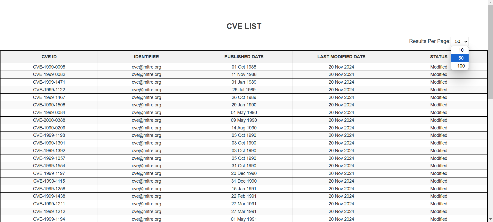
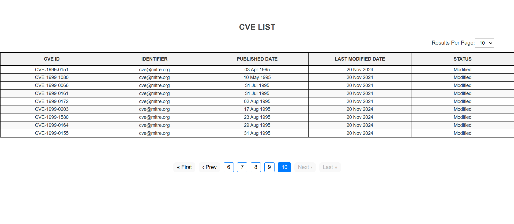
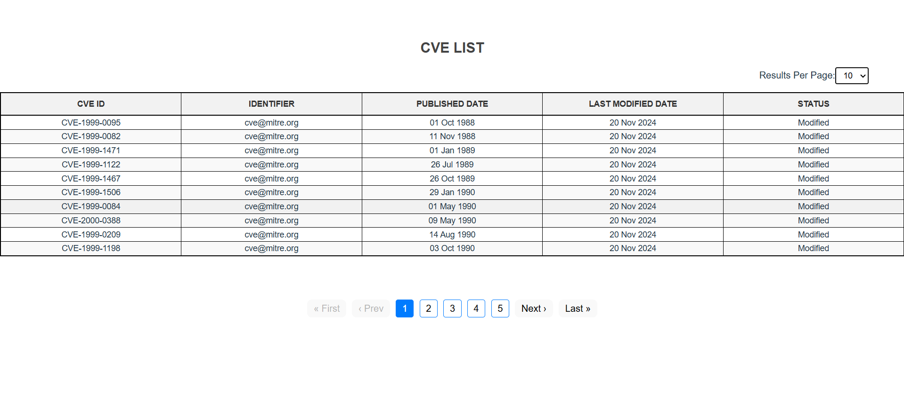
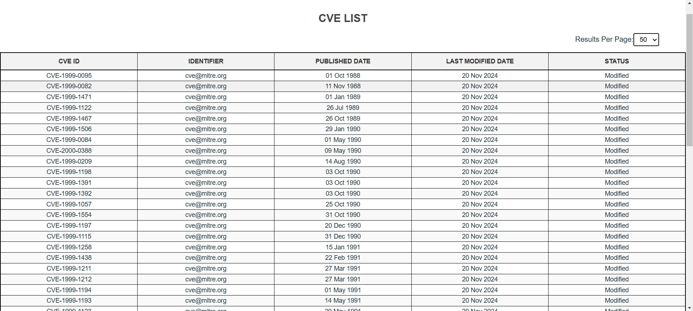
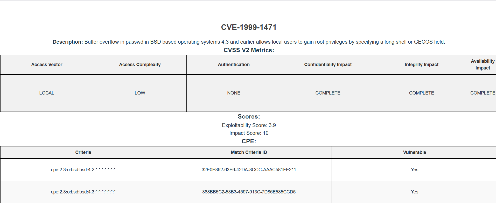

# Securin Assessment

A comprehensive CVE (Common Vulnerabilities and Exposures) management system built as part of the Securin assessment. This application features dynamic data fetching, pagination with a carousel-style navigation, and detailed CVE information display.

---

## 📋 Table of Contents
1. [Problem Statement](#problem-statement)
2. [Logical Approach](#logical-approach)
3. [Quality of Code](#quality-of-code)
4. [Input and Output Screenshots](#input-and-output-screenshots)
5. [Setup Instructions](#setup-instructions)
6. [Features](#features)
7. [Repository Link](#repository-link)

---

## 📌 Problem Statement

The application addresses the following requirements:

1. **CVE List View:** Display essential details such as ID, source identifier, publication date, last modified date, and status.
2. **Detailed CVE Information:** Fetch and display metrics like CVSS scores and configurations for a selected CVE.
3. **Dynamic Pagination:** Allow users to change the number of records displayed per page dynamically.
4. **Pagination Carousel:** Provide an intuitive carousel-style navigation for better user experience.

---

## 🧠 Logical Approach

### 1. **Dynamic Data Fetching**
- Used `axios` to fetch CVE data from the backend via POST requests.
- Leveraged `useEffect` to re-fetch data dynamically whenever the dropdown or pagination state changes.

### 2. **Pagination Logic**
- Maintained `currentPage` and `recordsPerPage` in state variables.
- Calculated the total number of pages based on records and displayed them dynamically in the carousel.

### 3. **Carousel Navigation**
- Showed a limited set of page numbers in the carousel for easy navigation.
- Allowed users to navigate to the previous and next sets of pages seamlessly.

### 4. **Detailed CVE View**
- Rendered comprehensive details for a selected CVE, including CVSS scores, configurations, and additional metadata.

### 5. **Responsive Design**
- Styled components for usability on various screen sizes, ensuring responsiveness across devices.

---

## ✅ Quality of Code

- **Modular Design:** Divided code into reusable React components for better scalability.
- **State Management:** Used `useState` and `useEffect` effectively for managing data and application states.
- **Error Handling:** Implemented fallback messages for API errors or missing data.
- **Code Readability:** Included clear and concise comments explaining key logic.

---

## 📷 Input and Output Screenshots

### Input

1. **Dropdown for Results Per Page**
   - Adjust the number of records displayed dynamically.
    
2. **Carousel for Page Navigation**
   - Navigate between pages using an intuitive carousel.
     

### Output

1. **List of CVEs**
   - Displays essential CVE details in a structured table.

2. **Detailed CVE View**
   - Showcases metrics, configurations, and additional details of a selected CVE.
  

## 🛠️ Overall Approach

### **Frontend Development**
- Designed and built the user interface using **React** for modularity and responsiveness.
- Styled components using **CSS** to maintain simplicity and a clean look.

### **Data Handling**
- Used **Axios** to fetch CVE data from the backend API via POST requests.
- Dynamically sliced the fetched data array to display only the required rows per page, ensuring efficient rendering.

### **Pagination Design**
- Implemented a **sliding window** approach to display a limited set of page numbers for better navigation.
- Updated the **current page** dynamically based on user interactions, allowing seamless transitions.

### **User Experience**
- Added a **dropdown** above the table to let users control the number of rows displayed per page (e.g., 10, 50, 100).
- Ensured **smooth transitions** between pages with a carousel-style navigation system for an intuitive experience.
